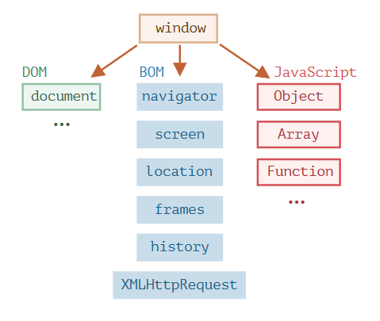

# 浏览器环境，规格

JavaScript 语言最初是为 Web 浏览器创建的。此后，它已经演变成了一种具有多种用途和平台的语言。

平台可以是一个浏览器，一个 Web 服务器，或其他 **主机（host）**

主机环境提供了自己的对象和语言核心以外的函数。Web 浏览器提供了一种控制网页的方法。Node.JS 提供了服务器端功能，等等。

JavaScript 在浏览器中运行时的鸟瞰示意图：

首先就是 `window` 的"根"对象，它代表两种含义：

1. 是 JavaScript 代码的全局对象（[globalThis](https://zh.javascript.info/global-object)）
2. 代表“浏览器窗口”，并提供了控制它的方法

## DOM 与 CSSOM

文档对象模型（Document Object Model），简称 DOM，将所有页面内容表示为可以修改的对象。

`document` 对象是页面的主要“入口点”。我们可以使用它来更改或创建页面上的任何内容。

另外也有一份针对 CSS 规则和样式表的、单独的规范 [CSS Object Model (CSSOM)](https://www.w3.org/TR/cssom-1/)，这份规范解释了如何将 CSS 表示为对象，以及如何读写这些对象。

## 浏览器对象模型（BOM）

浏览器对象模型（Browser Object Model），简称 BOM，表示由浏览器（主机环境）提供的用于处理文档（document）之外的<strong style='color:red'>所有内容</strong>的其他对象。例如:

- [navigator](https://developer.mozilla.org/zh/docs/Web/API/Window/navigator) 对象提供了有关浏览器和操作系统的背景信息。
- [location](https://developer.mozilla.org/zh/docs/Web/API/Window/location) 对象允许我们读取当前 URL，并且可以将浏览器重定向到新的 URL。
