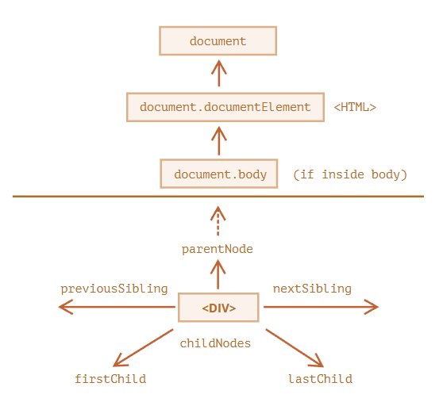
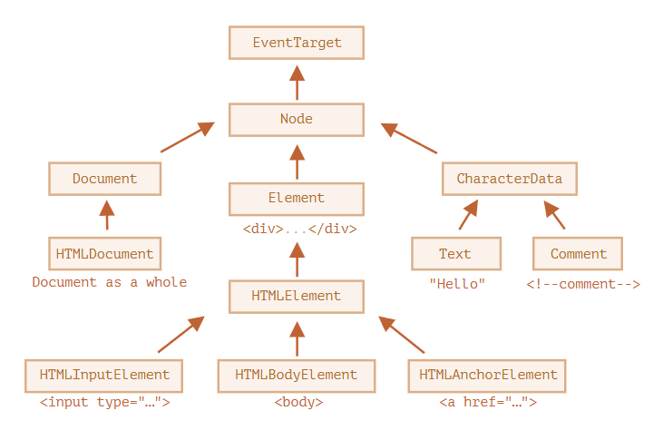
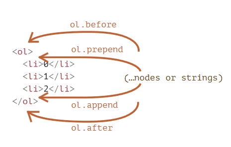
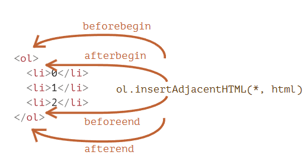
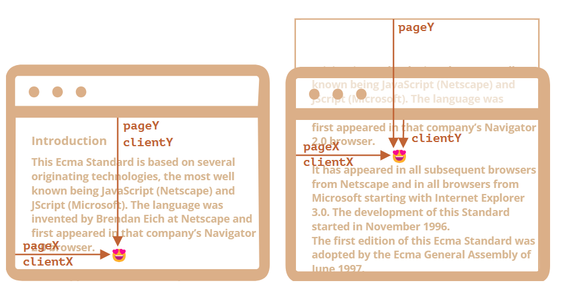
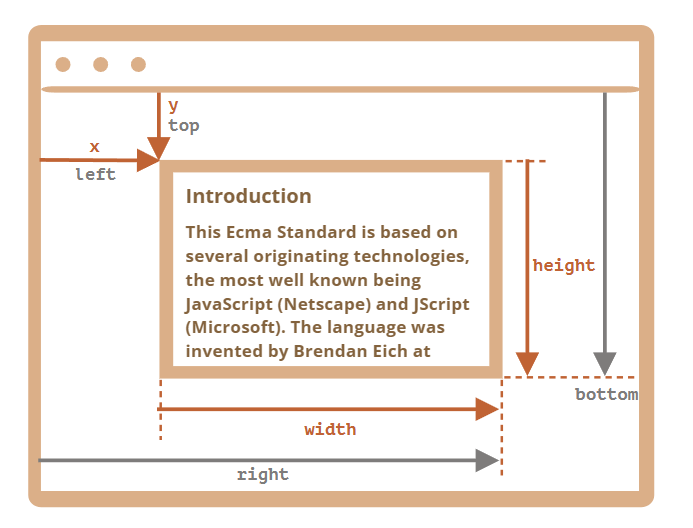

# DOM

> 根据文档对象模型（DOM），每个 HTML 标签都是一个对象。

一共有 [12 种节点类型](https://dom.spec.whatwg.org/#node)。实际上，我们通常用到的是其中的 4 种：

1. `document` —— DOM 的“入口点”。
2. 元素节点 —— HTML 标签，树构建块。
3. 文本节点 —— 包含文本。
4. 注释 —— 有时我们可以将一些信息放入其中，它不会显示，但 JS 可以从 DOM 中读取它。

# 操作 DOM

DOM 让我们可以对元素和它们中的内容做任何事情，但是首先需要获取到 DOM 对象。

对 DOM 的所有操作都是以 `document` 对象开始，它是 DOM 的主入口



## 顶层 DOM 元素

最顶层的树节点可以直接作为 `document` 的属性来使用

- **`<html>` = `document.documentElement`**

  最顶层的 `document` 节点是 `document.documentElement`。这是对应 `<html>` 标签的 DOM 节点

- **`<body>` = `document.body`**

  另一个被广泛使用的 DOM 节点是 `<body>` 元素 —— `document.body`

- **`<head>` = `document.head`**

  `<head>` 标签可以通过 `document.head` 访问。

## 子节点

- **子节点（或者叫作子）** —— 对应的是直系的子元素。换句话说，它们被完全嵌套在给定的元素中。例如，`<head>` 和 `<body>` 就是 `<html>` 元素的子元素。
- **子孙元素** —— 嵌套在给定元素中的所有元素，包括子元素，以及子元素的子元素等。

**`childNodes` 集合列出了所有子节点，包括文本节点。**

**`firstChild` 和 `lastChild` 属性是访问第一个和最后一个子元素的快捷方式。**

> 还有一个特别的函数 `elem.hasChildNodes()` 用于检查节点是否有子节点。

## 兄弟节点和父节点

**兄弟节点（sibling）** 是指有同一个父节点的节点。

例如，`<head>` 和 `<body>` 就是兄弟节点：

```html
<html>
  <head>
    ...
  </head>
  <body>
    ...
  </body>
</html>
```

- `<body>` 可以说是 `<head>` 的“下一个”或者“右边”兄弟节点。
- `<head>` 可以说是 `<body>` 的“前一个”或者“左边”兄弟节点。

下一个兄弟节点在 `nextSibling` 属性中，上一个是在 `previousSibling` 属性中。

可以通过 `parentNode` 来访问父节点。

## 导航链接

上面列出的导航（navigation）属性引用 **所有** 节点。让我们看看更多只考虑 **元素节点** 的导航链接（navigation link），只是在词中间加了 `Element`：

- `children` —— 仅那些作为元素节点的子代的节点。
- `firstElementChild`，`lastElementChild` —— 第一个和最后一个子元素。
- `previousElementSibling`，`nextElementSibling` —— 兄弟元素。
- `parentElement` —— 父元素。

> 在 JavaScript 的 DOM 中，`children`，`firstElementChild`，`nextElementSibling` 这些属性被称为 **元素节点属性（元素节点的导航链接）**。
>
> 这些属性与 `childNodes`，`firstChild`，`nextSibling` 等导航属性的主要区别在于，元素节点属性只返回元素节点，而不返回文本节点和注释节。
>
> 例如，`firstElementChild` 属性返回指定元素的第一个子元素，而 `firstChild` 返回第一个子节点，可能是元素节点、文本节点或注释节点。
>
> 同样，`children` 返回子元素，而 `childNodes` 返回子节点，包括元素节点、文本节点和注释节点。这些属性都是只读的。

# 搜索 DOM

| 方法名                   | 搜索方式     | 可以在元素上调用？ | 实时的？ |
| ------------------------ | ------------ | ------------------ | -------- |
| `querySelector`          | CSS-selector | ✔                  | -        |
| `querySelectorAll`       | CSS-selector | ✔                  | -        |
| `getElementById`         | `id`         | -                  | -        |
| `getElementsByName`      | `name`       | -                  | ✔        |
| `getElementsByTagName`   | tag or `'*'` | ✔                  | ✔        |
| `getElementsByClassName` | class        | ✔                  | ✔        |

> 目前为止，最常用的是 `querySelector` 和 `querySelectorAll`，但是 `getElement(s)By*` 可能会偶尔有用，或者可以在旧脚本中找到。

此外：

- `elem.matches(css)` 用于检查 `elem` 与给定的 CSS 选择器是否匹配。
- `elem.closest(css)` 用于查找与给定 CSS 选择器相匹配的最近的祖先。`elem` 本身也会被检查。

让我们在这里提一下另一种用来检查子级与父级之间关系的方法，因为它有时很有用：

- 如果 `elemB` 在 `elemA` 内（`elemA` 的后代）或者 `elemA==elemB`，`elemA.contains(elemB)` 将返回 true。

# 常用 DOM 对象属性

每个 DOM 节点都属于一个特定的类。这些类形成层次结构（hierarchy）。完整的属性和方法集是继承的结果。

主要的 DOM 节点属性有：

- `nodeType`

  可以使用它来查看节点是文本节点还是元素节点。它具有一个数值型值（numeric value）：`1` 表示元素，`3` 表示文本节点，其他一些则代表其他节点类型。只读。

- `nodeName/tagName`

  用于元素名，标签名（除了 XML 模式，都要大写）。对于非元素节点，`nodeName` 描述了它是什么。只读。

- `innerHTML`

  元素的 HTML 内容。可以被修改。

- `outerHTML`

  元素的完整 HTML。对 `elem.outerHTML` 的写入操作不会触及 `elem` 本身。而是在外部上下文中将其替换为新的 HTML。

- `nodeValue/data`

  非元素节点（文本、注释）的内容。两者几乎一样，我们通常使用 `data`。可以被修改。

- `textContent`

  元素内的文本：HTML 减去所有 `<tags>`。写入文本会将文本放入元素内，所有特殊字符和标签均被视为文本。可以安全地插入用户生成的文本，并防止不必要的 HTML 插入。

- `hidden`

  当被设置为 `true` 时，执行与 CSS `display:none` 相同的事。

DOM 节点还具有其他属性，具体有哪些属性则取决于它们的类。例如，`<input>` 元素（`HTMLInputElement`）支持 `value`，`type`，而 `<a>` 元素（`HTMLAnchorElement`）则支持 `href` 等。大多数标准 HTML 特性（attribute）都具有相应的 DOM 属性。



## 特性和属性

属性(property) 和 特性(attribute)，属性更多的是指 DOM 对象上的属性，而特性更多的是指 HTML 标签的属性。

- 特性（attribute）—— 写在 HTML 中的内容。
- 属性（property）—— DOM 对象中的内容。

简略的对比：

|      | 属性                                   | 特性                         |
| :--- | :------------------------------------- | :--------------------------- |
| 类型 | 任何值，标准的属性具有规范中描述的类型 | 字符串                       |
| 名字 | 名字（name）是大小写敏感的             | 名字（name）是大小写不敏感的 |

操作特性的方法：

- `elem.hasAttribute(name)` —— 检查是否存在这个特性。
- `elem.getAttribute(name)` —— 获取这个特性值。
- `elem.setAttribute(name, value)` —— 设置这个特性值。
- `elem.removeAttribute(name)` —— 移除这个特性。
- `elem.attributes` —— 所有特性的集合。

# DOM 操作

**创建新节点的方法：**

- `document.createElement(tag)` —— 用给定的标签创建一个元素节点，
- `document.createTextNode(value)` —— 创建一个文本节点（很少使用），
- `elem.cloneNode(deep)` —— 克隆元素，如果 `deep==true` 则与其后代一起克隆。

**以下方法为安全操作方法，类似与 `textContent` 而不是 `innerHTML`**

- `node.append(...nodes or strings)` —— 在 `node` **末尾** 插入节点或字符串，
- `node.prepend(...nodes or strings)` —— 在 `node` **开头** 插入节点或字符串，
- `node.before(...nodes or strings)` —— 在 `node` **前面** 插入节点或字符串，
- `node.after(...nodes or strings)` —— 在 `node` **后面** 插入节点或字符串，
- `node.replaceWith(...nodes or strings)` —— 将 `node` 替换为给定的节点或字符串。
- `node.remove()` —— 移除 `node`。



**通用方法 `elem.insertAdjacentHTML(where,html)`**

参数说明：

1. `"beforebegin"` —— 将 `html` 插入到 `elem` 之前，
2. `"afterbegin"` —— 将 `html` 插入到 `elem` 开头，
3. `"beforeend"` —— 将 `html` 插入到 `elem` 末尾，
4. `"afterend"` —— 将 `html` 插入到 `elem` 之后。



> 另外，还有类似的方法，`elem.insertAdjacentText` 和 `elem.insertAdjacentElement`，它们会插入文本字符串和元素，但很少使用。

**旧时代的方法，不建议使用了**

- `parent.appendChild(node)`
- `parent.insertBefore(node, nextSibling)`
- `parent.removeChild(node)`
- `parent.replaceChild(newElem, node)`

# 样式和类

要管理 class，有两个 DOM 属性：

- `className` —— 字符串值，可以很好地管理整个类的集合。
- `classList` —— 具有 `add/remove/toggle/contains` 方法的对象，可以很好地支持单个类。
  - `elem.classList.add/remove(class)` —— 添加/移除类。
  - `elem.classList.toggle(class)` —— 如果类不存在就添加类，存在就移除它。
  - `elem.classList.contains(class)` —— 检查给定类，返回 `true/false`。


要改变样式：

- `style` 属性是具有驼峰（camelCased）样式的对象。对其进行读取和修改与修改 `"style"` 特性（attribute）中的各个属性具有相同的效果。要了解如何应用 `important` 和其他特殊内容 —— 在 [MDN](https://developer.mozilla.org/zh/docs/Web/API/CSSStyleDeclaration) 中有一个方法列表。
- `style.cssText` 属性对应于整个 `"style"` 特性（attribute），即完整的样式字符串。

要读取已解析的（resolved）样式（对于所有类，在应用所有 CSS 并计算最终值之后）：

- `getComputedStyle(elem, [pseudo])` 返回与 `style` 对象类似的，且包含了所有类的对象。只读。

# 元素大小和滚动

## Offset 系列

`offset`系列 是“最外面”的几何属性，所以我们从这里开始

- `offsetParent` 是最接近的祖先（ancestor），在浏览器渲染期间，它被用于计算坐标。

  最近的祖先为下列之一：

  - CSS 定位的（`position` 为 `absolute`、`relative`、`fixed` 或 `sticky`）
  - 或 `<td>`，`<th>`，`<table>`
  - 或 `<body>`

- `offsetLeft/offsetTop` 提供相对于 `offsetParent` 左上角的 x/y 坐标。

- `offsetWidth/Height` 提供元素外部 width、height，元素的完整大小

## Client 系列

`client` 直译过来表示“客户端”的意思，我们可以理解成元素的 content 区域

- `clientLeft/clientTop` —— 从元素左上角外角到左上角内角的距离。对于从左到右显示内容的操作系统来说，它们始终是左侧/顶部 border 的宽度。而对于从右到左显示内容的操作系统来说，垂直滚动条在左边，所以 `clientLeft` 也包括滚动条的宽度。

- `clientWidth/clientHeight` —— 内容的 width/height，包括 padding，但不包括滚动条（scrollbar）。

## Scroll 系列

`scroll` 系列是关于滚动条的几何属性

- `scrollWidth/scrollHeight` —— 内容的 width/height，就像 `clientWidth/clientHeight` 一样，但还包括元素的滚动出的不可见的部分。
- `scrollLeft/scrollTop` —— 从元素的左上角开始，滚动出元素的上半部分的 width/height。

> 除了 `scrollLeft/scrollTop` 外，所有属性都是只读的。如果我们修改 `scrollLeft/scrollTop`，浏览器会滚动对应的元素。

# Window 大小

对于此类信息，我们可以使用与 `<html>` 标签相对应的根文档元素 `document.documentElement`。

浏览器也支持像 `window.innerWidth/innerHeight` 这样的属性。

如果这里有一个滚动条，它占用了一些空间，那么这两行代码会显示不同的值：

```js
window.innerWidth; // 整个窗口的宽度
document.documentElement.clientWidth; // 减去滚动条宽度后的窗口宽度
```

## 根节点的 width/height

> 我们可以通过使用 `documentElement.scrollWidth/scrollHeight` 来测量文档的完整大小。
>
> 但是在该元素上，对于整个文档，这些属性均无法正常工作。在 Chrome/Safari/Opera 中，如果没有滚动条，`documentElement.scrollHeight` 甚至可能小于 `documentElement.clientHeight`！

```js
// 为了可靠地获得完整的文档高度，我们应该采用以下这些属性的最大值：
let scrollHeight = Math.max(
  document.body.scrollHeight,
  document.documentElement.scrollHeight,
  document.body.offsetHeight,
  document.documentElement.offsetHeight,
  document.body.clientHeight,
  document.documentElement.clientHeight
);

alert("Full document height, with scrolled out part: " + scrollHeight);
```

## 获取当前滚动

> 在大多数浏览器中，我们可以使用 `document.documentElement.scrollLeft/scrollTop`，但在较旧的基于 WebKit 的浏览器中则不行，例如在 Safari（bug [5991](https://bugs.webkit.org/show_bug.cgi?id=5991)）中，我们应该使用 `document.body` 而不是 `document.documentElement`。

由于历史原因，存在了这两种属性来获取浏览器滚动距离，但它们是一样的：

- `window.pageXOffset` 是 `window.scrollX` 的别名。
- `window.pageYOffset` 是 `window.scrollY` 的别名。

更改当前的滚动：

- `window.scrollTo(pageX,pageY)` —— 绝对坐标，
- `window.scrollBy(x,y)` —— 相对当前位置进行滚动，
- `elem.scrollIntoView(top)` —— 滚动以使 `elem` 可见（`elem` 与窗口的顶部/底部对齐）。

## 坐标

大多数 JavaScript 方法处理的是以下两个坐标系中的一个

- 相对于 **窗口** —— 类似于 `position:fixed`，从窗口(window)的顶部/左侧边缘计算得出

  将它们表示为 `clientX/clientY`

- 相对于 **文档** —— 与文档根（document root）的 `position:absolute` 类似，从文档的顶部/左侧边缘计算得出。

  将它们表示为 `pageX/pageY`



## 元素坐标：getBoundingClientRect

方法 `elem.getBoundingClientRect()` 返回最小矩形的窗口坐标

主要的 `DOMRect` 属性：

- `x/y` —— 矩形原点相对于窗口的 X/Y 坐标，
- `width/height` —— 矩形的 width/height（可以为负）。

此外，还有派生（derived）属性：

- `top/bottom` —— 顶部/底部矩形边缘的 Y 坐标，
- `left/right` —— 左/右矩形边缘的 X 坐标。



1. 相对于窗口的坐标 —— `elem.getBoundingClientRect()`。
2. 相对于文档的坐标 —— `elem.getBoundingClientRect()` 加上当前页面滚动(pageXOffset)。

## elementFromPoint(x, y)

对 `document.elementFromPoint(x, y)` 的调用会返回在窗口坐标 `(x, y)` 处嵌套最多（the most nested）的元素。对于在窗口之外的坐标，`elementFromPoint` 返回 `null`

