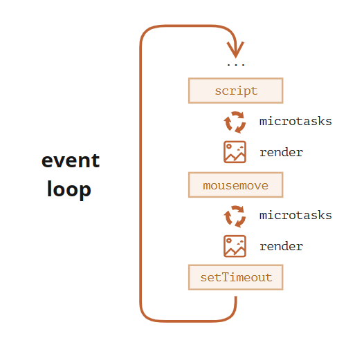

# 事件循环

**事件循环** 的概念非常简单：它是一个在 JavaScript 引擎等待任务、执行任务、进入休眠状态等待更多任务这几个状态之间转换的无限循环。

## 宏任务、微任务

宏任务：编写的常规代码，函数、循环、计时器……

微任务：

- 通常是由 promise 创建的：对 `.then/catch/finally` 处理程序的执行会成为微任务。
- 还有一个特殊的函数 `queueMicrotask(func)`，它对 `func` 进行排队，以在微任务队列中执行。

>**Tips：每个宏任务之后，引擎会立即执行微任务队列中的所有任务，然后再执行其他的宏任务，或渲染，或进行其他任何操作。**
>
>**事件循环算法（简化后）**
>
>1. 从 **宏任务** 队列中出队并进行执行
>   - 执行过程中如果遇到 **微任务** ，就将它添加到 **微任务队列** 中
>2. 执行所有 **微任务**（依次执行）
>3. 开始检查渲染，如果页面有变更，则 GUI 线程接管渲染，将变更渲染出
>4. 如果宏任务队列为空，则进入休眠状态直到出现宏任务
>5. 跳转回步骤 1。

（顺序是从上到下，即：首先是脚本，然后是微任务，渲染等）

>对于不应该阻塞事件循环的耗时长的繁重计算任务，我们可以使用 [Web Workers](https://html.spec.whatwg.org/multipage/workers.html)。
>
>这是在另一个并行线程中运行代码的方式。
>
>Web Workers 可以与主线程交换消息，但是它们具有自己的变量和事件循环。
>
>Web Workers 没有访问 DOM 的权限，因此，它们对于同时使用多个 CPU 内核的计算非常有用。

## 阐述一下JS事件循环

1. 事件循环又称消息循环,因为W3C叫event loop,谷歌源码中为message loop
2. 事件循环是浏览器渲染主线程的工作方式
3. Chrome的源码中,开启了一个无限for循环, 每次循环从消息队列中取出首位进行执行,其他的线程在合适的机会将任务插入消息队列
4. 曾经把消息队列分为宏队列和微队列,已无法满足现代复杂的浏览器环境,取而代之是一种更加灵活的方式处理
5. 根据W3C官方描述,不同的任务类型,放在不同的任务队列中,不同的队列有着不同的优先级,微队列优先级最高,交互任务队列其次,其他队列由浏览器自行决定
