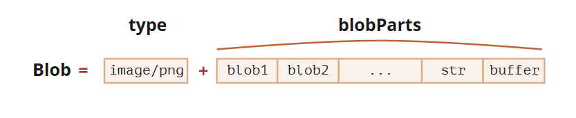

# 二进制数据

在 Web 开发中，当我们处理文件时（创建，上传，下载），经常会遇到二进制数据。还有一个典型的应用场景是图像处理。

在 JavaScript 中有很多种二进制数据格式：

- `ArrayBuffer`，`Uint8Array`，`DataView`，`Blob`，`File` ……

## 相关概念性东西

### ArrayBuffer

**`ArrayBuffer` （二进制数组缓冲区） 是核心对象，是对固定长度的连续内存区域的引用。**

我们这样创建它：

```js
// 创建一个长度为 16字节 的 buffer（二进制数组缓冲区）
let buffer = new ArrayBuffer(16);  // 会分配一个 16 字节的连续内存空间，并用 0 进行预填充
alert(buffer.byteLength); // 16 （byteLength = 字节长度）
```

### TypedArray

**几乎任何对 `ArrayBuffer` 的操作，都需要一个 “视图” 对象。**

- 它可以是 `TypedArray`：
  - `Uint8Array`，`Uint16Array`，`Uint32Array` —— 用于 8 位、16 位和 32 位无符号整数。
  - `Uint8ClampedArray` —— 用于 8 位整数，在赋值时便“固定”其值。
  - `Int8Array`，`Int16Array`，`Int32Array` —— 用于有符号整数（可以为负数）。
  - `Float32Array`，`Float64Array` —— 用于 32 位和 64 位的有符号浮点数。
- 或 `DataView` —— 使用方法来指定格式的视图，例如，`getUint8(offset)`。

**视图对象本身并不存储任何东西。你可以理解为它是一副“眼镜”，透过"眼镜"来解析存储在 `ArrayBuffer` 中的字节**

所有这些视图（`Uint8Array`，`Uint32Array`……）都属于 `TypedArray` 类型（类型化数组）

#### 方法

....暂时不理解，后续学习[ArrayBuffer，二进制数组 (javascript.info)](https://zh.javascript.info/arraybuffer-binary-arrays#typedarray-fang-fa)

## TextDecoder 和 TextEncoder

### TextDecoder

假设，我们收到了一个包含文本数据的文件。

内建的 `TextDecoder` 对象在给定缓冲区（buffer）和编码格式（encoding）的情况下，允许将值读取为实际的 JavaScript 字符串。

首先，我们要先创建实例：

```js
let decoder = new TextDecoder([label], [options]);
```

- **`label`** —— 编码格式，默认为 `utf-8`，但同时也支持 `big5`，`windows-1251` 等许多其他编码格式。

- `options` —— 可选对象：

  - **`fatal`** —— 布尔值

    如果为 `true` 则为无效（不可解码）字符抛出异常，否则（默认）用字符 `\uFFFD` 替换无效字符。

  - **`ignoreBOM`** —— 布尔值

    如果为 `true` 则忽略 BOM（可选的字节顺序 Unicode 标记），很少需要使用。

然后进行解码:

```js
let str = decoder.decode([input], [options]);
```

- **`input`** —— 要被解码的 `BufferSource`。
- `options` —— 可选对象：
  - **`stream`** —— 对于解码流，为 true，则将传入的数据块（chunk）作为参数重复调用 `decoder`。在这种情况下，多字节的字符可能偶尔会在块与块之间被分割。这个选项告诉 `TextDecoder` 记住“未完成”的字符，并在下一个数据块来的时候进行解码。

例子:

```js
let uint8Array = new Uint8Array([72, 101, 108, 108, 111]);
alert( new TextDecoder().decode(uint8Array) ); // Hello
```

### TextEncoder

[TextEncoder](https://encoding.spec.whatwg.org/#interface-textencoder) 做相反的事情 —— 将字符串转换为字节。

语法为：

```javascript
let encoder = new TextEncoder(); // 只支持 utf-8 编码。
```

实例两种方法：

- **`encode(str)`** —— 从字符串返回 `Uint8Array`。
- **`encodeInto(str, destination)`** —— 将 `str` 编码到 `destination` 中，该目标必须为 `Uint8Array`。

## Blob

 `Blob`（Binary Large Object 二进制大对象），通常用于处理大块的二进制数据，比如图像、音频、视频等。

它可以包含任意类型的数据，并且可以与其他File API（比如文件读取器和数据 URL）一起使用。

> <strong style='color:red'>为什么使用 Blob？</strong>
>
> 1. **二进制数据处理：** `Blob` 是处理二进制数据的一种标准方式，适用于图像、音频、视频等。
> 2. **与文件 API 配合：** 可以与其他文件相关的 API 配合使用，比如文件读取器、数据 URL、XMLHttpRequest 等。
> 3. **网络传输：** 在进行文件上传或下载时，`Blob` 是常见的数据类型。

**Blob组成：**

1. 一个可选的字符串 `type`（通常是 MIME 类型）
2. `blobParts` —— 一系列其他 `Blob` 对象，字符串和 `BufferSource`。



构造函数语法：

```js
new Blob(blobParts, options);
```

- **`blobParts`** 是 `Blob`/`BufferSource`/`String` 类型的值的数组。
- `options` 可选对象：
  - **`type`** —— `Blob` 类型，通常是 MIME 类型，例如 `image/png`，
  - **`endings`** —— 是否转换换行符，使 `Blob` 对应于当前操作系统的换行符（`\r\n` 或 `\n`）。默认为 `"transparent"`（啥也不做），不过也可以是 `"native"`（转换）。

```js
// 从字符串创建 Blob
let blob = new Blob(["<html>…</html>"], {type: 'text/html'});
// 请注意：第一个参数必须是一个数组 [...]
```

我们可以用 `slice` 方法来提取 `Blob` 片段：

```javascript
blob.slice([byteStart], [byteEnd], [contentType]);
```

- **`byteStart`** —— 起始字节，默认为 0。
- **`byteEnd`** —— 最后一个字节（不包括，默认为最后）。
- **`contentType`** —— 新 blob 的 `type`，默认与源 blob 相同。

### 用作URL

>Blob 可以很容易用作 `<a>`、`` 或其他标签的 URL，来显示它们的内容。
>
>多亏了 `type`，让我们也可以下载/上传 `Blob` 对象，而在网络请求中，`type` 自然地变成了 `Content-Type`。

一个简单的实例：

```html
<!-- download 特性（attribute）强制浏览器下载而不是导航 -->
<a download="hello.txt" href='#' id="link">Download</a>

<script>
let blob = new Blob(["Hello, world!"], {type: 'text/plain'});

link.href = URL.createObjectURL(blob);
</script>
```

### 转换为 Base64

`URL.createObjectURL` 的一个替代方法是，将 `Blob` 转换为 base64-编码的字符串。

这种编码将二进制数据表示为一个由 0 到 64 的 ASCII 码组成的字符串，非常安全且“可读“。最重要的是我们可以在 “data-url” 中使用此编码

[“data-url”](https://developer.mozilla.org/zh/docs/Web/http/Data_URIs) 的形式为 `data:[<mediatype>][;base64],<data>`。我们可以在任何地方使用这种 url，和使用“常规” url 一样。我们使用内建的 `FileReader` 对象来将 `Blob` 转换为 base64。

| URL.createObjectURL(blob)                                    | Blob转换为 data url                                          |
| ------------------------------------------------------------ | ------------------------------------------------------------ |
| 如果介意内存，我们需要撤销（revoke）它们 <br />直接访问 `Blob`，无需“编码/解码” | 无需撤销（revoke）任何操作。 <br />对大的 `Blob` 进行编码时，性能和内存会有损耗。 |

相关学习链接：[Blob (javascript.info)](https://zh.javascript.info/blob#image-zhuan-huan-wei-blob)

## File 和 FileReader

### File

File 对象继承自 `Blob`，拓展类与文件系统相关的功能

我们有两种方式可以获取到它：

**第一种**：与 `Blob` 类似，直接使用构造函数

```js
new File(fileParts, fileName, [options])
```

- **`fileParts`** —— Blob/BufferSource/String 类型值的数组。
- **`fileName`** —— 文件名字符串。
- `options` —— 可选对象：
  - **`lastModified`** —— 最后一次修改的时间戳（整数日期）。

**第二种**：更常见的是：从 `<input type="file">` 或拖放或其他浏览器接口来获取文件。

由于 `File` 是继承自 `Blob` 的，所以 `File` 对象具有相同的属性，附加：

- `name` —— 文件名，
- `lastModified` —— 最后一次修改的时间戳。

```html
<input type="file" onchange="showFile(this)">

<script>
function showFile(input) {
  let file = input.files[0];

  alert(`File name: ${file.name}`); // 例如 my.png
  alert(`Last modified: ${file.lastModified}`); // 例如 1552830408824
}
</script>
```

> **请注意：**
>
> input 可以选择多个文件，因此 `input.files` 是一个类数组对象。这里我们只有一个文件，所以我们只取 `input.files[0]`。

### FileReader

文件读取器FileReader，唯一的目的就是读取 `Blob` 和 `File` 对象中的数据

```js
let reader = new FileReader(); // 没有参数
```

主要方法有：

- **`readAsArrayBuffer(Blob)`** —— 将数据读取为二进制格式的 `ArrayBuffer`
- **`readAsText(blob, [encoding])`** —— 将数据读取为给定编码（默认为 utf-8 编码）的文本字符串。
- **`readAsDataURL(blob)`** —— 读取二进制数据，并将其编码为 base64 的 data url。
- **`abort()`** —— 取消操作。

读取过程中有以下事件：

- `loadstart` —— 开始加载。
- `progress` —— 在读取过程中出现。
- `load` —— 读取完成，没有 error。
- `abort` —— 调用了 `abort()`。
- `error` —— 出现 error。
- `loadend` —— 读取完成，无论成功还是失败。

读取完成后，我们可以通过以下方式访问读取结果：

- `reader.result` 是结果（如果成功）
- `reader.error` 是 error（如果失败）。
