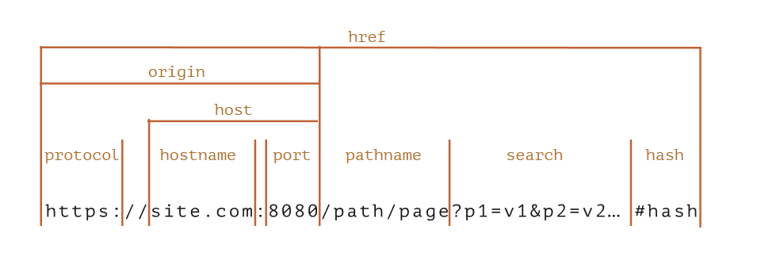

# URL对象

内建的 [URL](https://url.spec.whatwg.org/#api) 类提供了用于创建和解析 URL 的便捷接口。

没有任何一个网络方法一定需要使用 `URL` 对象，字符串就足够了。所以从技术上讲，我们并不是必须使用 `URL`。但是有些时候 `URL` 对象真的很有用。

## 创建 URL 对象

```js
new URL(url,[base])
```

- **`url`** —— 完整的 URL，或者仅路径（如果设置了 base），
- **`base`** —— 可选的 base URL：如果设置了此参数，且参数 `url` 只有路径，则会根据这个 `base` 生成 URL。

`URL` 对象立即允许我们访问其组件，因此这是一个解析 url 的好方法，例如：

```js
let url = new URL('https://javascript.info/url');

alert(url.protocol); // https:
alert(url.host);     // javascript.info
alert(url.pathname); // /url
```



## 静态方法

URL.createObjectURL(blob) 获得本地内存容器中URL 方便预览
