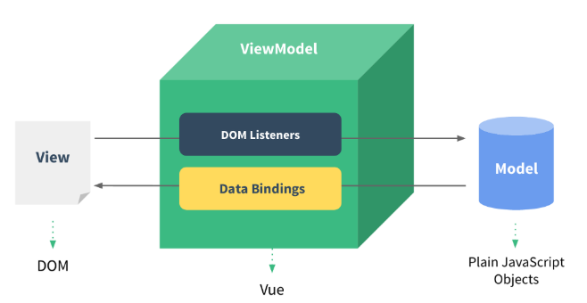

# VUE

> Vue是一个轻量级的前端框架,[VUE2官方文档]([介绍 — Vue.js (vuejs.org)](https://v2.cn.vuejs.org/v2/guide/))

## MVVM模型

> MVVM是一种软件架构模式，它可以让视图（View）和模型（Model）之间实现双向绑定，即视图的变化会自动反映到模型中，模型的变化也会自动更新到视图中。

- M模型(model)：表示数据，对应Vue中的`data`选项，它是一个对象，包含了应用程序的状态和逻辑。

- V视图(View)：表示用户界面，对应Vue中的**模板**，它是一段HTML代码，可以用模板语法来显示数据和绑定事件。

- VM视图模型(ViewModel)：表示视图和模型之间的桥梁，对应Vue中的**实例**，它是一个对象，负责监听模型的变化并更新视图，以及处理视图的交互并更新模型。

MVVM模型对于VUE:

1. data中所有的属性,最后都出现在vm身上
2. vm身上所有的属性及Vue原型上所有的属性,在Vue模版中都可以直接使用

## v-for中的key有什么作用

1. 虚拟DOM中的`key`作用

   key是虚拟DOM对象的标识,当状态中的数据发生变化时,Vue会根据新数据生成新的虚拟DOM

   随后使用新虚拟DOM与旧虚拟DOM进行差异比较,规则如下:

2. 对比规则:

   1. 旧虚拟DOM中找到了与新虚拟DOM相同的`key`

      1. 若虚拟DOM中内容不变,直接使用之前的真实DOM
      2. 若虚拟DOM中改变,则生成新真实DOM,随后替换掉之前页面的真实DOM

   2. 旧虚拟DOM中未找到与新虚拟DOM相同的`key`

      则直接创建新的真实DOM,随后渲染到页面

3. 用`index`作为`key`可能会引发的问题

   1. 若对数据进行:逆序添加,逆序删除等破坏性操作:

      会产生没有必要的真实DOM更新 => 页面展示效果无问题,但效率低下

   2. 若结构中还包含输入类的DOM

      会产生错误的DOM更新 => 页面效果会出现问题

4. 开发中如何选择key?

   1. 最好使用每条数据的唯一标识,比如id,手机号,身份证号,学号等唯一值

   2. 若不存在对数据的逆序添加、删除等破坏性操作，仅用于页面渲染列表用于展示

      也可以使用index作为key，这样是没有问题的
      
      

## Vue中监视数据的原理

1. Vue会监视data中所有层次的数据

2. 如何检测对象中的数据?

   通过setter实现监视,且要在new vue时就传入要监测的数据

   1. 对象中后追加的属性,Vue默认不做响应

   2. 如果后添加的属性要做响应式,使用如下API

      `Vue.set(target,propertyName/index,value)`

      `vm.$set(target,propertyName/index,value)`

3. 如何监测数组中的数据?

   通过包裹数据更新元素的方法实现,本质就是做了两件事

   1. 调用原生对应的方法对数组更新
   2. 重新解析模版,进而更新页面

4. 在Vue修改数组中的某个元素一定要使用如下方法

   1. 使用`push`、`pop`、`shift`、`unshift`、`splice`、`sort`、`reverse`这7个方法
   2. `Vue.set`或`vm.$set`

> `Vue.set`/`vm.$set`不能给vm或vm根数据添加属性