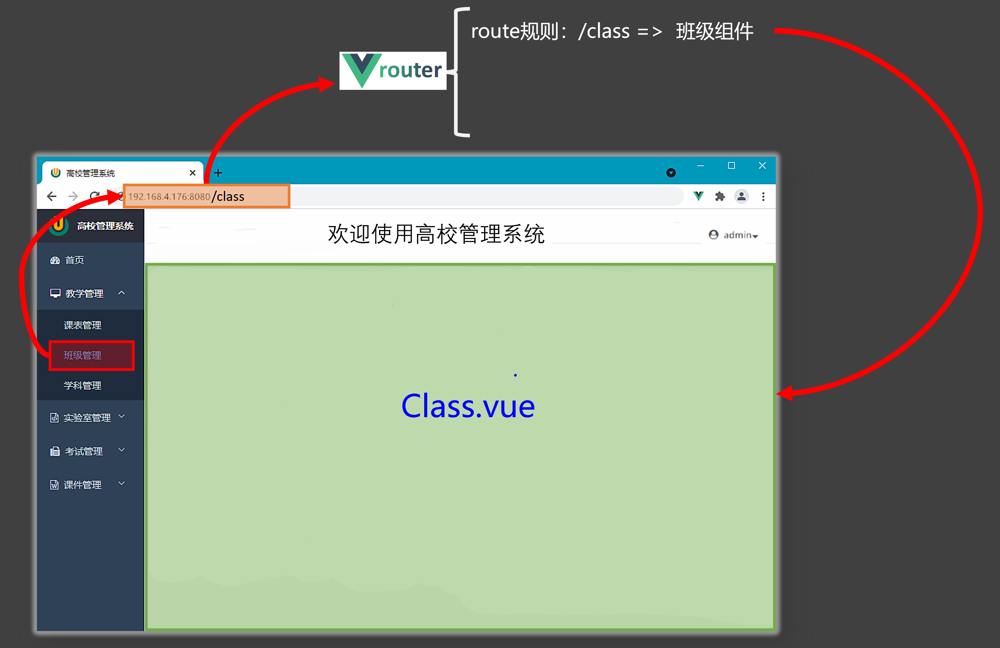

# 路由

在编写代码的过程中，由我们亲自写标签的组件是一般组件，否则就是路由组件，路由组件一般存放在 pages、views文件中



>1. 路由组件通常存放在`pages` 或 `views`文件夹，一般组件通常存放在`components`文件夹。
>
>2. 通过点击导航，视觉效果上“消失” 了的路由组件，默认是被**卸载**掉的，需要的时候再去**挂载**。

## 工作模式

1. `history`模式

   > 优点：`URL`更加美观，不带有`#`，更接近传统的网站`URL`。
   >
   > 缺点：后期项目上线，需要服务端配合处理路径问题，否则刷新会有`404`错误。
   >
   > ```js
   > const router = createRouter({
   > 	history:createWebHistory(), //history模式
   > 	/******/
   > })
   > ```

2. `hash`模式

   > 优点：兼容性更好，因为不需要服务器端处理路径。
   >
   > 缺点：`URL`带有`#`不太美观，且在`SEO`优化方面相对较差。
   >
   > ```js
   > const router = createRouter({
   > 	history:createWebHashHistory(), //hash模式
   > 	/******/
   > })
   > ```

## 示例代码

- 路由配置文件代码如下：

  ```js
  import {createRouter,createWebHistory} from 'vue-router'
  import Home from '@/pages/Home.vue'
  import News from '@/pages/News.vue'
  import About from '@/pages/About.vue'
  
  const router = createRouter({
  	history:createWebHistory(),
  	routes:[
  		{
  			path:'/home',
  			component:Home
  		},
  		{
  			path:'/about',
  			component:About
  		}
  	]
  })
  export default router
  ```

* `main.ts`代码如下：

  ```js
  import router from './router/index'
  app.use(router)
  
  app.mount('#app')
  ```

- `App.vue`代码如下

  ```vue
  <template>
    <div class="app">
      <h2 class="title">Vue路由测试</h2>
      <!-- 导航区 -->
      <div class="navigate">
        <RouterLink to="/home" active-class="active">首页</RouterLink>
        <RouterLink to="/news" active-class="active">新闻</RouterLink>
        <RouterLink to="/about" active-class="active">关于</RouterLink>
      </div>
      <!-- 展示区 -->
      <div class="main-content">
        <RouterView></RouterView>
      </div>
    </div>
  </template>
  
  <script lang="ts" setup name="App">
    import {RouterLink,RouterView} from 'vue-router'  
  </script>
  ```

## 路由传参

### query参数

   1. 传递参数

      ```vue
      <!-- 跳转并携带query参数（to的字符串写法） -->
      <router-link to="/news/detail?a=1&b=2&content=欢迎你">
      	跳转
      </router-link>
      				
      <!-- 跳转并携带query参数（to的对象写法） -->
      <RouterLink 
        :to="{
          //name:'xiang', //用name也可以跳转
          path:'/news/detail',
          query:{
            id:news.id,
            title:news.title,
            content:news.content
          }
        }"
      >
        {{news.title}}
      </RouterLink>
      ```

   2. 接收参数：

      ```js
      import {useRoute} from 'vue-router'
      const route = useRoute()
      // 打印query参数
      console.log(route.query)
      ```


### params参数

   1. 传递参数

      ```vue
      <!-- 跳转并携带params参数（to的字符串写法） -->
      <RouterLink :to="`/news/detail/001/新闻001/内容001`">{{news.title}}</RouterLink>
      				
      <!-- 跳转并携带params参数（to的对象写法） -->
      <RouterLink 
        :to="{
          name:'xiang', //用name跳转
          params:{
            id:news.id,
            title:news.title,
            content:news.title
          }
        }"
      >
        {{news.title}}
      </RouterLink>
      ```

   2. 接收参数：

      ```js
      import {useRoute} from 'vue-router'
      const route = useRoute()
      // 打印params参数
      console.log(route.params)
      ```

> 备注1：传递`params`参数时，若使用`to`的对象写法，必须使用`name`配置项，不能用`path`。
>
> 备注2：传递`params`参数时，需要提前在规则中占位。

## 路由的props配置

作用：让路由组件更方便的收到参数（可以将路由参数作为`props`传给组件）

```js
{
	name:'xiang',
	path:'detail/:id/:title/:content',
	component:Detail,

  // props的对象写法，作用：把对象中的每一组key-value作为props传给Detail组件
  // props:{a:1,b:2,c:3}, 

  // props的布尔值写法，作用：把收到了每一组params参数，作为props传给Detail组件
  // props:true
  
  // props的函数写法，作用：把返回的对象中每一组key-value作为props传给Detail组件
  props(route){
    return route.query
  }
}
```

